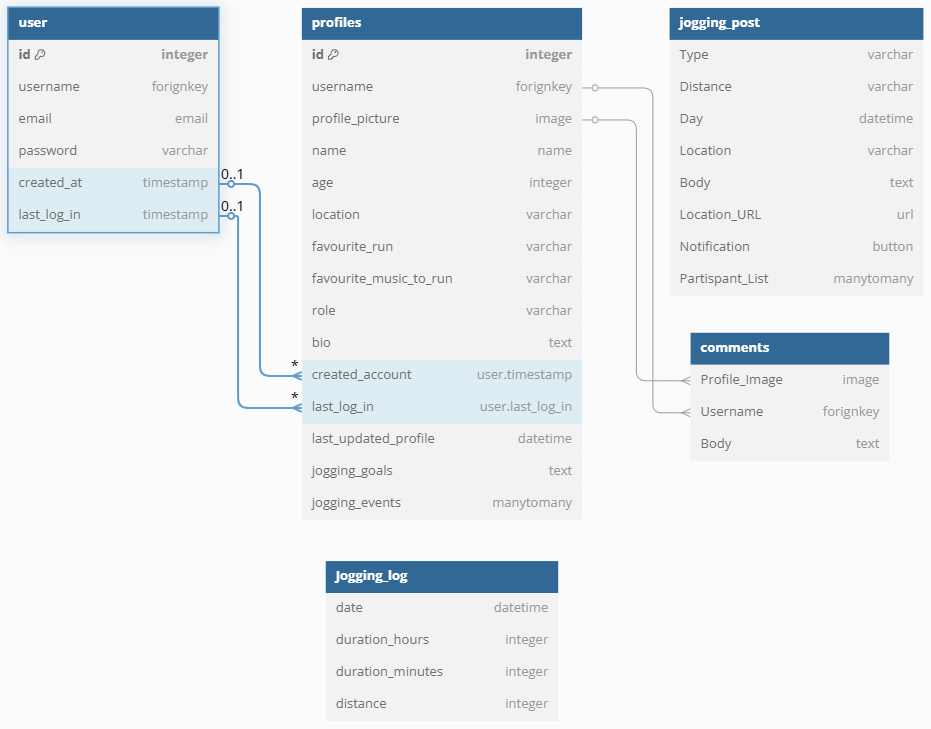

# Really Love Running

(Developers: [Charles Tack](https://github.com/CharlesTack), [Charlie Flockhart](https://github.com/charlieflockhart), [Jack Groves](https://github.com/jackgroves2024), [Ashrafur Ahmed](https://github.com/Ashrafur93))

[Link to deployed site](https://really-love-running-92dc01beda45.herokuapp.com/)

Really Love Running is a full stack website which is a practical implementation of a static website project which we 4 Developers built individually as a project earlier on in our Web Development journey as part of our training at [Code Institute](https://codeinstitute.net/). 
Really Love Running is designed to create a supportive community for runners of all levels. The platform allows users to share their running experiences, track their progress, and access valuable resources to improve their fitness journey. By fostering a sense of camaraderie and motivation, the website aims to encourage more people to take up running as a regular physical activity.

# Table Of Content

- [User Stories](#user-stories)
- [Design](#design)
    - [Wireframes](#wireframes)
    - [Database Schema](#database-schema)
- [Features](#features)
- [Technology Stack](#technology-stack)
- [Deployment](#deployment)
- [Future Enhancements](#future-enhancements)
- [Conclusion](#conclusion)
- [Credits](#credits)

## User Stories

[(Really Love Running Project Board)](https://github.com/users/Ashrafur93/projects/8/views/1)

1. As a developer I want to use wireframes so that I can have a clear idea of the site's structure and theme. [#11](https://github.com/users/Ashrafur93/projects/8/views/1?pane=issue&itemId=97627549&issue=Ashrafur93%7Creally-love-running%7C11)
2. As a user I want to read comments, I want to read comments on location pages so that I can see what others have shared about their experiences. [#4](https://github.com/users/Ashrafur93/projects/8/views/1?pane=issue&itemId=97615324&issue=Ashrafur93%7Creally-love-running%7C4)
3. As a user I want to post comments, so that I can share my ideas and opinions with the community. [#3](https://github.com/users/Ashrafur93/projects/8/views/1?pane=issue&itemId=97609574&issue=Ashrafur93%7Creally-love-running%7C3)
4. As a user, I want to sign up and log in securely so that I can access my jogging social profile. [#1](https://github.com/users/Ashrafur93/projects/8/views/1?pane=issue&itemId=97598397&issue=Ashrafur93%7Creally-love-running%7C1)
5. As a user I want to join jogging events, so that I can participate in group runs and meet other joggers. [#2](https://github.com/users/Ashrafur93/projects/8/views/1?pane=issue&itemId=97607610&issue=Ashrafur93%7Creally-love-running%7C2)
6. As a user, I want to follow/unfollow other users, so that I can stay connected with my jogging community. [#7](https://github.com/users/Ashrafur93/projects/8/views/1?pane=issue&itemId=97619434&issue=Ashrafur93%7Creally-love-running%7C7)
7. As a user, I want to log my jogs (date, duration, distance), so that I can track my progress. [#6](https://github.com/users/Ashrafur93/projects/8/views/1?pane=issue&itemId=97619034&issue=Ashrafur93%7Creally-love-running%7C6)
8. As a returning user, I want to edit my profile, so that I can update my information. [#5](https://github.com/users/Ashrafur93/projects/8/views/1?pane=issue&itemId=97617295&issue=Ashrafur93%7Creally-love-running%7C5)
9. As a user, I want to see a leaderboard of top runners so that I can compare my performance with others. [#8](https://github.com/users/Ashrafur93/projects/8/views/1?pane=issue&itemId=97622159&issue=Ashrafur93%7Creally-love-running%7C8)
10. As a user, I want to see my ranking, so that I know where I stand. [#9](https://github.com/users/Ashrafur93/projects/8/views/1?pane=issue&itemId=97622352&issue=Ashrafur93%7Creally-love-running%7C9)

## Design

### Wireframes

The wireframes were built using [Balsamiq](https://balsamiq.com/):

#### Mobile

Home

Meetup

Profile

Gallery

Signup

Login

Logout

#### Tablet

Home

Meetup

Profile

Gallery

Signup

Login

Logout

#### Desktop

Home

Meetup

Profile

Gallery

Signup

Login

Logout

### Database Schema

The entity relationship diagram was built using [DBDiagram](https://dbdiagram.io/home):

Database Schema screenshot

## Features

- **User Profiles**: Each user can create a profile to track their running stats, set goals, and share their achievements with the community.
- **Community chat**: A space for users to discuss various topics related to running, including training tips and run preparation.
- **Event Calendar**: Users can find and participate in local running events, runs and meetups.

## Technology Stack

- **Frontend**: HTML, CSS, JavaScript, and Bootstrap for responsive design.
- **Backend**: Django framework with Python for robust and scalable web application development.
- **Database**: PostgreSQL for reliable data storage and management.
- **Media**: Cloudinary for image hosting.

## Deployment

- **Platform:** [Heroku](https://www.heroku.com/)
- **High-Level Deployment Steps:** 
  1. Clone the repository
  2. Set up the Heroku environment with a PostgreSQL database.
  3. Configure environment variables for sensitive data (e.g., secret keys).
  4. Deploy using Heroku GitHub integration.
- **Verification and Validation:**
  - Tested the deployed application against the development environment for consistent functionality and design.
  - Verified accessibility using tools such as Lighthouse and manual testing.
- **Security Measures:**
  - Sensitive data is stored in environment variables.
  - DEBUG mode is disabled in the production environment to enhance security.

## Future Enhancements

- **Mobile App**: Development of a mobile application to provide users with on-the-go access to the platform.
Future developments can include:
- **User Posts**: The ability for users to post custom meetup cards which other users can interact with.
- **Running Partners/Groups**: A buddy system where users can be matched up with each other depending on their running goals and preferences. An advanced version of this would pair a user with an experienced runner.
- **Maps Integration**: A Google API map showing popular running routes and nearby facilities such as water stations and restrooms.
- **Moderator Powers**: Enhanced moderation tools to ensure a safe and supportive community by reviewing posts before publication.
- **Advanced Analytics**: Integration of advanced analytics to provide users with deeper insights into their running performance.
- **Social Media Integration**: Allow users to share their progress and achievements on social media platforms to inspire others.
- **Ranking System**: Allow users to compete with each other to rise in the on-site ranking leaderboards.

## Conclusion

Really Love Running is more than just a website; it's a community dedicated to promoting a healthy and active lifestyle through running. By providing a platform for runners to connect, share, and learn, we aim to make running an enjoyable and accessible activity for everyone.

## Credits

- [Remaker](https://remaker.ai/face-swap-free/) and [Fotor](https://www.fotor.com/apps/swapper/) were used to create face-swapped images.
- README documentation ideas and content were from DarrachBarneveld's project, [CoolCoders-PP4](https://github.com/DarrachBarneveld/CoolCoders-PP4).

- Images were taken from the following websites:
  - https://www.parkregisbirmingham.co.uk/blog/best-enjoy-birminghams-canals/
  - https://www.birmingham2022.com/venues/alexander-stadium
  - https://www.parkrun.org.uk/cannonhill/
  - https://www.birminghammail.co.uk/news/midlands-news/famous-birmingham-spot-everybody-knows-29936838
  - https://visitbirmingham.com/listing/run-of-a-kind/140870101/
  - https://commons.wikimedia.org/wiki/File:Profile_avatar_placeholder_large.png
  - https://visitbirmingham.com/listing/run-of-a-kind/140870101/
  - [Homepage, Gallery and Signup images were originally from Code Institute's Love Running project](https://learn.codeinstitute.net/courses/course-v1:CodeInstitute+LRFX101+6/courseware/e805068059af42af87681032aa64053f/92a91cf7fcee4361a2af651b7827a341/)